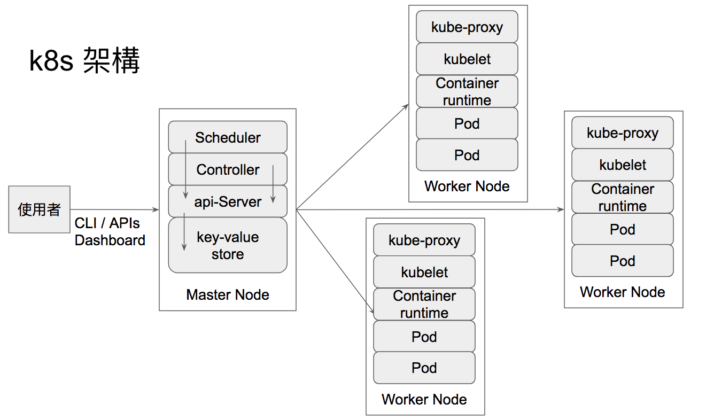

## Day 2 - k8s 架構

### 本日共賞

* k8s 架構
* Master Node
* Worker Node
* etcd

### 希望你知道

* [Container Orchestration](https://ithelp.ithome.com.tw/articles/10192193)

 

#### k8s 架構

簡單的說 k8s 包含了三個元件

* 一個或多個 Master Nodes
* 一個或多個 Worker Nodes
* 分散式鍵值儲存區, 例如 etcd

#### Master Node

在 k8s 中，Master 扮演著管理叢集的角色，管理者可以透過 CLI (Command Line Interface) 或 APIs (Application Programming Interface) 或控制介面 (Dashboard) 等等不同方式與 Master 溝通進而存取、控制或修改叢集狀態例如配置資源、擴充 Pod 數量等等。

作為一個 k8s 的使用者 / 管理者，你的工作就是告訴 Master 你想要做什麼 (不論透過何種方式，只要能把訊息傳遞到 Master )，剩下的事情就交給 k8s。

>在一個高容錯的環境中 Master 可以是多個。為了方便說明，k8s 不自賞一文均採用單一 Master 作為範例。

另外，k8s 利用 etcd 來儲存叢集的狀態。而 Master 會透過 etcd 了解目前叢集的運行狀況。

##### <u>api-server</u>

管理者會透過 REST command 把需要做的工作 (例如，新增或刪除物件) 傳送到 api-server ， api-server 會驗證並處理管理者要求執行的工作，當工作執行完畢後，叢集的最新狀態便會儲存到 etcd 中。

##### <u>Scheduler</u>

Scheduler 會知道目前 Worker Node 的狀況，當需要配置 Pod 時，Scheduler 會找出最合適的 Node 並配置 Pod。

##### <u>Controller</u>

Controller 會透過 api-server 了解目前叢集的狀態，並嘗試把目前狀態調整為管理者想要的狀態。

>管理者想要的狀態可能會因為種種原因無法達成，例如資源不夠 (cpu, memory) 等等。而 Controller 會持續嘗試著把叢集調整成管理者想要的狀態。

##### <u>etcd</u>

etcd 為鍵值儲存區 (key-value storage)，在 k8s 中被用來儲存叢集的狀態。

>etcd 可以是 Master 的一部分或者獨立被設置在外部。同樣的，當 etcd 被設置在外部時，Master 會連到 etcd 取得或更新叢集狀態。

#### Worker Node

Worker Node 簡單來說就是一台機器，它可以是一台實體機器或虛擬機 (VMs)。而多個運行單位 Pod 會被配置到 Worker Node 中運行，而每個 Pod 中含有一到多個容器。

##### <u>container runtime</u>

k8s 預設使用 docker 來建立容器

> 這次鐵人賽有大大分享 Docker 相關知識可以參考喔
> 
> [yangj26952](https://ithelp.ithome.com.tw/users/20103456/profile)： [用30天來介紹和使用 Docker](https://ithelp.ithome.com.tw/users/20103456/ironman/1320)
>
> [jia_hong](https://ithelp.ithome.com.tw/users/20107537/profile)： [讓我們來玩玩Docker吧](https://ithelp.ithome.com.tw/users/20107537/ironman/1417)

##### <u>kubelet</u>

kubelet 運行在 Worker Node，負責建立 Pod 中的容器。當 kubelet 收到來自 Master Node 送來 Pod 定義內容時，kubelet 會透過 container runtime 建立 Pod 需要的容器並確保容器狀態是可運行的。

##### <u>kube-proxy</u>

當 Pod 運行在 Worker Node 之後，外部需要透過 Service 這個 k8s 物件來與 Pod 連線而非直接存取 Pod。
kube-proxy 運行在 Worker Node 且持續監聽 api-server，並知道 Service 被建立或刪除。當 Service 被建立後，kube-proxy 會負責將 Request 導到對應的 Pod。

> 這裡提到的 Pod 與 Service 都是 k8s 中的基本物件，之後會有更詳細的討論。

##### <u>pod</u>

k8s 基本運行單位，應用程式 (application) 皆會以 Pod 為單位運行在 k8s 中，在之後的文章會有更詳細的說明。

#### etcd

k8s 中的 etcd 是由 go 寫成負責儲存叢集內的狀態與組態設定，包含 Secrets, ConfigMaps 等等

> Secrets 與 ConfigMaps 也是 k8s 中的基本物件，之後會有更詳細的討論。

本文同步發表於 [https://jlptf.github.io/ironman2018-day2/](https://jlptf.github.io/ironman2018-day2/)
